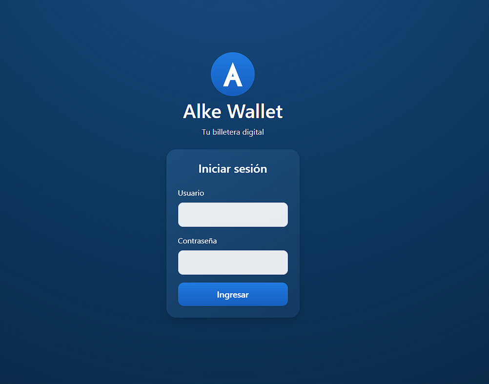
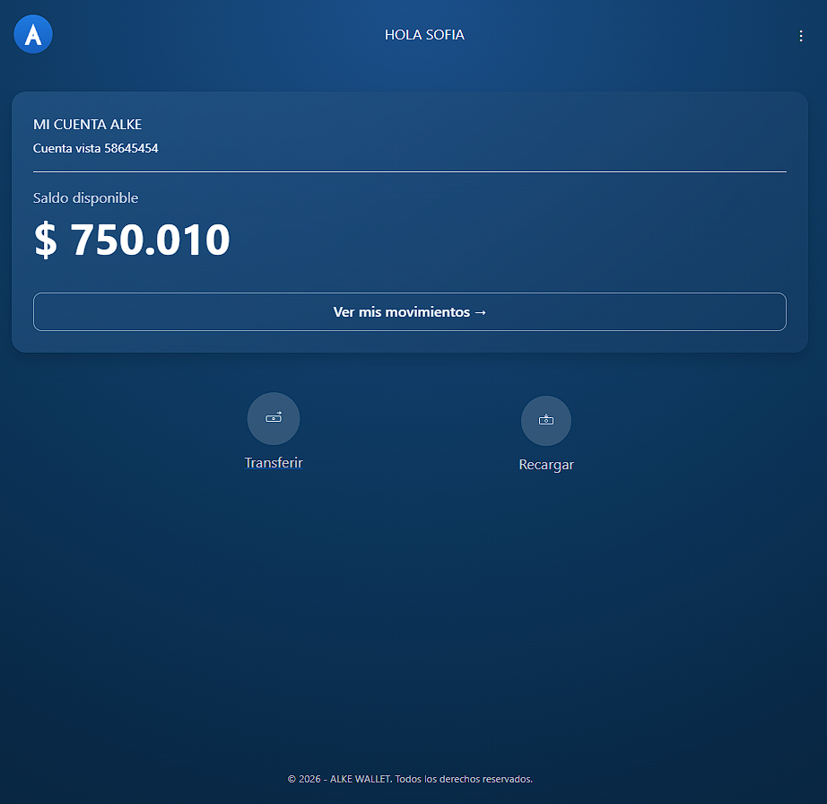
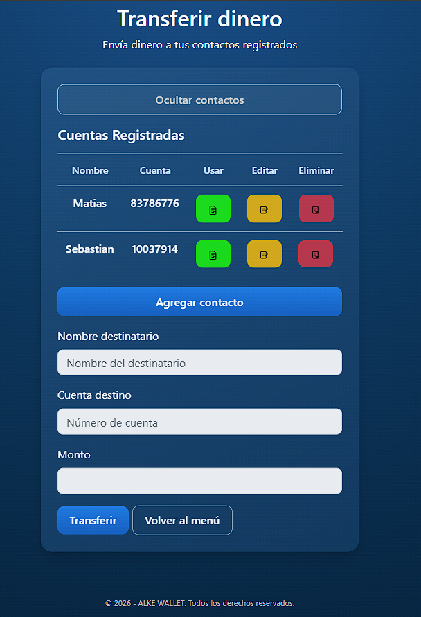
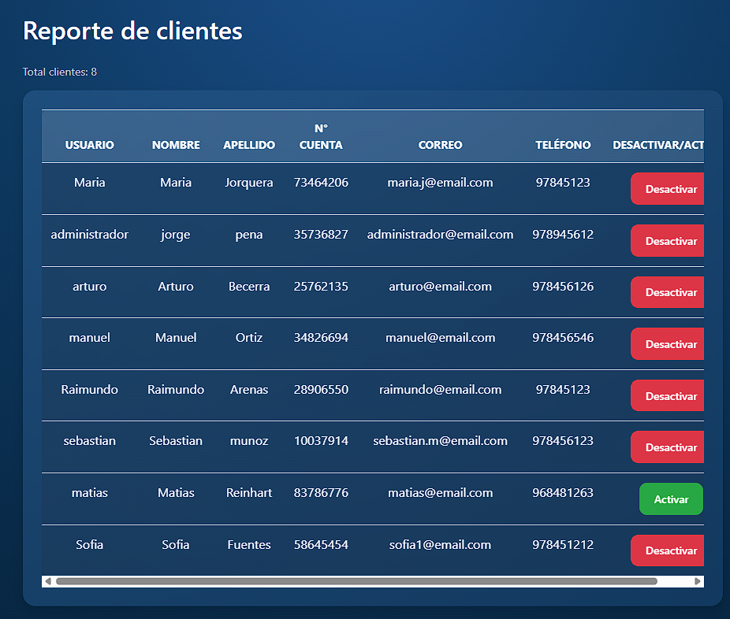

<h1 align="center"> Alke Wallet</h1>

Aplicación web tipo billetera digital desarrollada con Django. 
Proyecto Fullstack enfocado en lógica de negocio, persistencia de datos y seguridad básica.

<h2> Proyecto de Portafolio</h2>

Este proyecto fue desarrollado como parte del proceso de formación Fullstack Python, con el objetivo de simular una aplicación fintech real.

Alke Wallet permite a los usuarios gestionar su dinero, realizar transferencias, administrar contactos y visualizar movimientos, integrando backend, base de datos y frontend en una sola aplicación.

<h2> Caso de estudio</h2>

<h3> Descripción</h3>

Aplicación web construida con Django que simula el funcionamiento de una billetera digital, permitiendo operaciones como depósitos, transferencias y consulta de movimientos en tiempo real.

<h3> Problema a resolver</h3>

El principal desafío fue desarrollar un sistema que permitiera realizar transferencias de dinero de forma segura, evitando inconsistencias en los saldos y asegurando la integridad de los datos.

<h3> Solución implementada</h3>

<ul>
<li>Uso del ORM de Django para modelar entidades como Cliente, Cuenta, Movimiento y Contacto</li>
<li>Implementación de transacciones atómicas para asegurar consistencia en transferencias</li>
<li>Validaciones de negocio (saldo suficiente, cuenta válida, no auto-transferencias)</li>
<li>Sistema de permisos para diferenciar usuarios normales y administradores</li>
</ul>

Ejemplo de lógica crítica implementada:

<pre>
with transaction.atomic():
    cuenta_origen.saldo -= monto
    cuenta_destino.saldo += monto
</pre>

<h2> Tecnologías utilizadas</h2>

<ul>
<li><strong>Backend:</strong> Python, Django</li>
<li><strong>Base de datos:</strong> PostgreSQL</li>
<li><strong>Frontend:</strong> HTML5, CSS3, JavaScript, Bootstrap</li>
<li><strong>Arquitectura:</strong> MTV (Model - Template - View)</li>
</ul>

<h2> Modelo de datos</h2>

El sistema se estructura en base a relaciones entre entidades principales:

<ul>
<li><strong>Cliente:</strong> Información del usuario</li>
<li><strong>Cuenta:</strong> Asociada a un cliente, maneja saldo</li>
<li><strong>Movimiento:</strong> Registro de transacciones</li>
<li><strong>Contacto:</strong> Destinatarios frecuentes</li>
</ul>

Relación clave:

<pre>
Cliente → Cuenta (1 a 1)
Cuenta → Movimiento (1 a muchos)
Cliente → Contacto (1 a muchos)
</pre>

<h2> Seguridad y control de acceso</h2>

<ul>
<li>Autenticación de usuarios con sistema de Django</li>
<li>Vistas protegidas con login requerido</li>
<li>Permisos personalizados para acceso a reportes</li>
<li>Validación de datos en backend</li>
</ul>

Ejemplo:

<pre>
PermissionRequiredMixin
</pre>

<h2> Funcionalidades principales</h2>

<ul>
<li>Registro y autenticación de usuarios</li>
<li>Depósito de dinero</li>
<li>Transferencias entre cuentas</li>
<li>Historial de movimientos</li>
<li>CRUD de contactos</li>
<li>Panel administrativo con gestión de usuarios</li>
<li>Reportes de clientes (solo administradores)</li>
</ul>

<h2> Impacto del proyecto</h2>

<ul>
<li>Aplicación completamente funcional</li>
<li>Persistencia real de datos en base de datos</li>
<li>Simulación de lógica financiera</li>
<li>Implementación de seguridad básica</li>
<li>Arquitectura organizada y escalable</li>
</ul>

<h2> Aprendizajes clave</h2>

<ul>
<li>Uso real del ORM de Django</li>
<li>Manejo de transacciones seguras</li>
<li>Separación de responsabilidades (MTV)</li>
<li>Validación de datos y lógica de negocio</li>
<li>Integración completa fullstack</li>
</ul>

<h2> Instalación</h2>

<pre>
git clone https://github.com/razzkross01/alke-wallet-django-orm

cd alke-wallet-django-orm

pip install -r requirements.txt

python manage.py migrate

python manage.py runserver
</pre>

<h2> Vista previa</h2>

<h3> Inicio de sesión</h3>
  

<h3> Menú principal</h3>
  

<h3> Transferencias</h3>
  

<h3> Reportes administrativos</h3>

<h2>Autor</h2>

Raimundo Arenas 
Desarrollador Fullstack Python Trainee 
Chile

Proyecto desarrollado como parte de portafolio profesional

